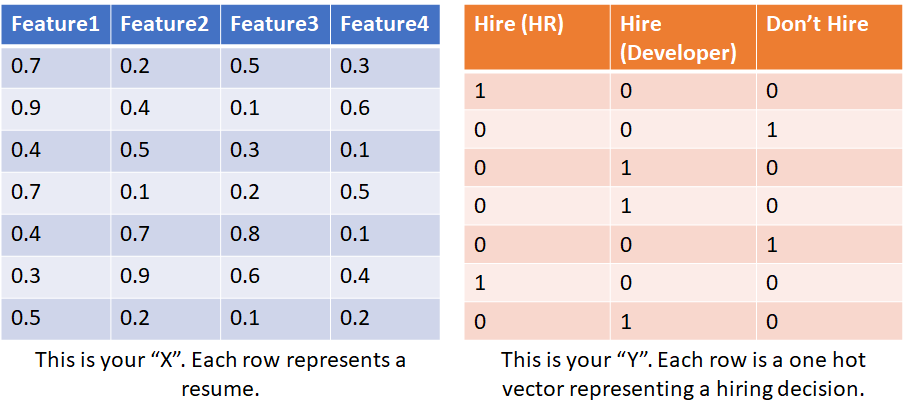
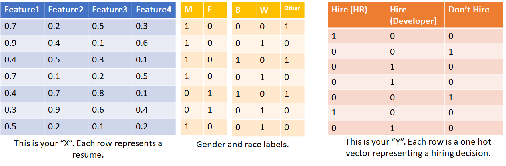

# Unbias

Keras based framework to build unbiased models from biased data.

-----

## Workflow

Suppose you are building a neural network that makes hiring decisions by looking at resumes. You train your model on data which contains past resumes and hiring decisions. You don't want any biases that were involved in making the past decisions be encoded in your model. This is how you do it:

1) Prepare your data:

Vectorize your resumes. Convert hiring decisions to one hots. Your data should look like this:




2) Normally you would train a Keras model directly on this data like this:

```python
from keras.models import Sequential
from keras.layers import *

X = ...
Y = ...

model = Sequential()
model.add(....)
model.add(....)
model.compile(...)
model.fit(X, Y)
```

But your data is probably biased, and your model will learn these biases as well. For e.g, your model might hire female candidates for HR positions even if they have programming experience. To resolve this, you need explicit labels for each axis along which your model might be biased. An axis of bias could be gender, race, age, or any feature which should not affect the final output of your model. In the real world, you might want to spend some time manually labelling each resume :(.



Note that your model can learn biases along such axes even if they are not among of your input features. For e.g, you may not have a 'gender' feature in your data, but gender can be inferred from other features, such as sports, words used in the resume (especially if you used word embeddings to encode free text), whether graduated from a boys' only school etc.

2) Build models:

Instead of building an end to end model that transforms your inputs to outputs, in the unbias workflow you build multiple models:

* Morpher
    The morpher models transforms your inputs to a representation that (ideally) does not contain any biases. Input shape should match the shape of your input data (X). Output shape is arbitrary.

* Task
    The task model does the actual task you are trying to do: in this case making a hiring decision. Input shape should be same as the output shape of morpher. Output shape should match the shape of your output data (Y).

* Discriminators
    For each axis of bias (gender, race, etc), you have to build a classification model called discriminator. Input shape should be same as the output shape of morpher. Output shape should match the corresponding labels data (labels).

3) Build Unbias model and fit your data

```python
unbias = Unbias(task, morpher, discriminators)
unbias.fit(x, y, labels)
```

You can use `unbias.inference_model` for inference, which is a standard Keras model:

```python
unbias.inference_model.predict(x)
```
